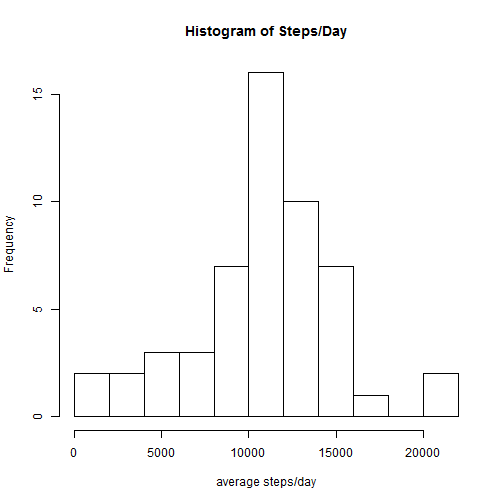
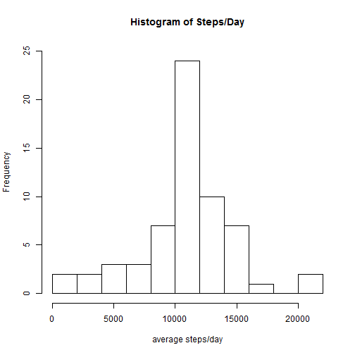
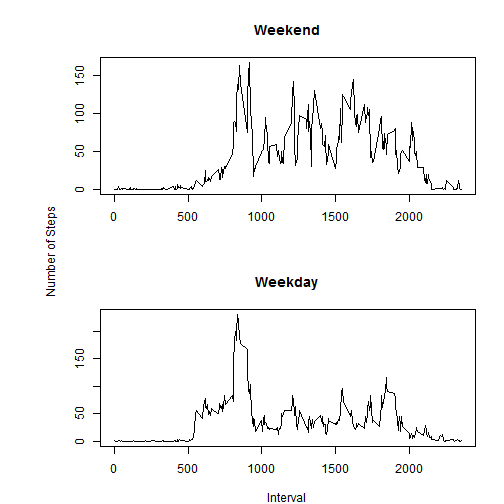

### Loading and preprocessing the data
##### Check if data or zip file is in directory with the .Rmd file  
    - if yes, load the data from the activity.csv file or unzip the compressed file and load the data  
    - if not, download the data, unzip and then load data

```r
zipUrl <- "https://d396qusza40orc.cloudfront.net/repdata%2Fdata%2Factivity.zip"

#check if data file is available and if not, download
if (!file.exists("activity.csv") & !file.exists("activity.zip")){
      if(!file.exists("activity.zip")){
            setInternet2(use=TRUE)
            download.file(zipUrl, destfile="activity.zip")
      }
}
if (!file.exists("activity.csv")){
      unzip("activity.zip")
}
activity_data <- read.csv("activity.csv")
```

### What is the mean total number of steps taken per day?

```r
#Create a table of the total steps per day
daysums <- aggregate(steps ~ date, data=activity_data, FUN=sum)
# Create histogram of the steps per day
hist(daysums$steps, breaks=10, main="Histogram of Steps/Day", xlab="average steps/day", ylim=c(0,25))
```

 

##### Mean total steps per day:

```r
#Calculate mean total steps per day
mean(daysums$steps)
```

```
## [1] 10766.19
```

### What is the average daily activity pattern?
##### Calculate the average steps for each 5 minute interval for all days:

```r
#Calculate and plot the average steps for each 5 minute interval for all days
interval_means <- aggregate(steps ~ interval, data=activity_data, FUN=mean)
plot(interval_means, type="l", main="Average daily activity pattern")
```

 
##### The 5-minute interval that, averaged across all days, has the maximum number of steps:

```r
interval_means[interval_means$steps==max(interval_means$steps),"interval"]
```

```
## [1] 835
```

### Imputing missing values

##### The total number of missing values:

```r
nrow(activity_data[is.na(activity_data$steps),])
```

```
## [1] 2304
```
(Note that exploratory analysis of the data shows there are no missing values
in the 'interval' or 'date' fields so only the 'steps' field needs to be assessed
for missing values.)   

##### Fill in missing values
For each time interval with a missing value, the average of available values for that time interval is used.


```r
#convert data.frame to data.table, fill in missing values with the mean of 
#available values for each time interval
library(data.table)
activity_data_dt <- data.table(activity_data)
activity_data_dt <- activity_data_dt[, intmeans:=mean(steps, na.rm=TRUE), by=interval]
activity_data_dt$steps <- ifelse(is.na(activity_data_dt$steps), activity_data_dt$intmeans, activity_data_dt$steps)

# Create histogram of steps taken each day
daysums2 <- aggregate(steps ~ date, data=activity_data_dt, FUN=sum, na.rm=TRUE)
hist(daysums2$steps, breaks=10, main="Histogram of Steps/Day", xlab="average steps/day", ylim=c(0,25))
```

 
##### Mean total steps/day:

```r
mean(daysums2$steps)
```

```
## [1] 10766.19
```
##### Median total steps/day:

```r
median(daysums2$steps)
```

```
## [1] 10766.19
```
After adding the imputed values, the total steps per day increases for days that had missing values. However, since the missing values for each interval are the average of available values, the mean values do not change.

### Are there differences in activity patterns between weekdays and weekends?

```r
#Convert date field to date type
activity_data_dt$date <- as.Date(as.character(activity_data_dt$date))
#add day type field with values weekend (for Saturday and Sunday) and weekday for all other values
activity_data_dt$daytype <- ifelse(weekdays(activity_data_dt$date) %in% c("Saturday", "Sunday"), "weekend", "weekday")
#convert to factor
activity_data_dt$daytype <- as.factor(activity_data_dt$daytype)
#Subset the data then calculate the average value for each time interval
weekdays <- subset(activity_data_dt, daytype=="weekday")
weekends <- subset(activity_data_dt, daytype=="weekend")
weekday_avs <- aggregate(steps~interval, data=weekdays, FUN=mean)
weekend_avs <- aggregate(steps~interval, data=weekends, FUN=mean)
#Create plot of subsets
par(mfrow=c(2,1), oma = c(0,4,0,0),mar=c(4,3,4,2))
plot(weekend_avs, type="l", main="Weekend", xlab="", ylab="")
plot(weekday_avs, type="l", main="Weekday", xlab="Interval", ylab="")
mtext("Number of Steps", side=2, outer=TRUE)
```

 

There definitely appear to be differences in the weekday pattern compared to the weekend. For example, on weekdays time intervals between roughly 500 and 800 all have average step counts near 50 or higher but on the weekend the same time intervals have counts much lower than 50 but gradually increasing with time. On the other hand, time intervals between roughly 1000 and 2000 mostly have much higher counts for the weekend than during the week.
