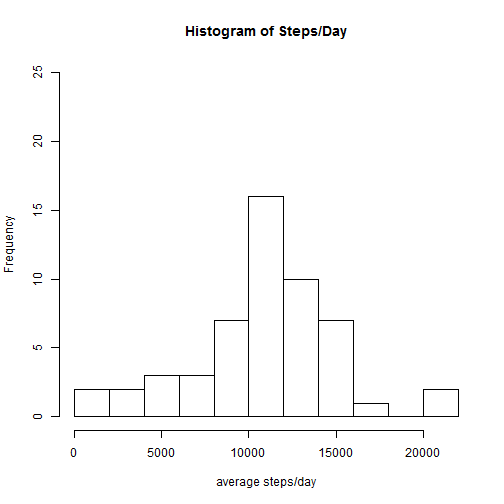
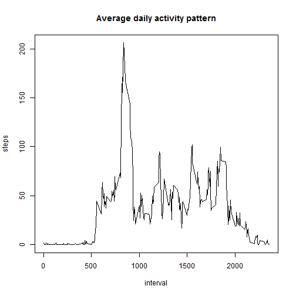
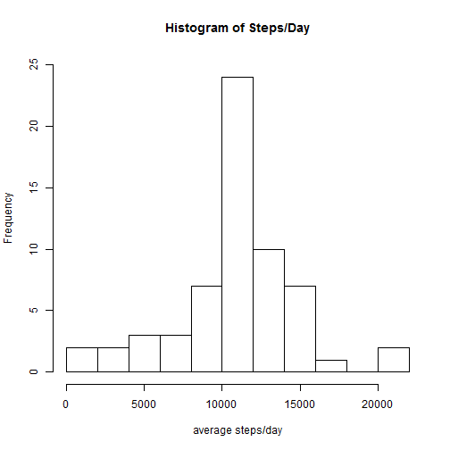
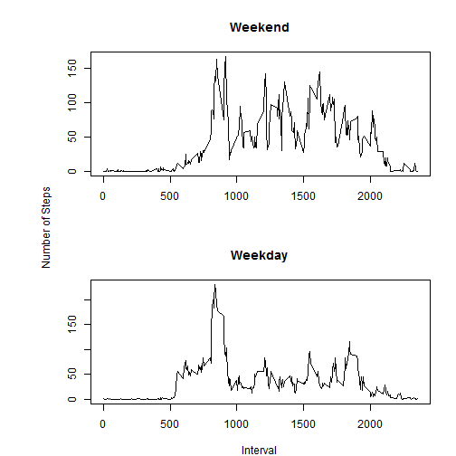

```r
###Delete this code chunk before submitting
###Use this in console to create files to upload to Github:
#knit2html("PA1_template.Rmd")
```

## Loading and preprocessing the data
#### Check if data or zip file is in directory with this .Rmd file  
    - if yes, load or unzip and load  
    - if not, download, unzip and load

```r
zipUrl <- "https://d396qusza40orc.cloudfront.net/repdata%2Fdata%2Factivity.zip"
setInternet2(use=TRUE)
#######Remove following 1 line before submission
setwd("C:/MJs_files/courses/ReproducibleData/assign1")
if (!file.exists("activity.csv") & !file.exists("activity.zip")){
      if(!file.exists("activity.zip")){
      download.file(zipUrl, destfile="activity.zip")
      }
}
if (!file.exists("activity.csv")){
      unzip("activity.zip")
}
activity_data <- read.csv("activity.csv")
```

## What is the mean total number of steps taken per day?

```r
daysums <- aggregate(steps ~ date, data=activity_data, FUN=sum)
hist(daysums$steps, breaks=10, main="Histogram of Steps/Day", xlab="average steps/day", ylim=c(0,25))
```

 

#### Mean total steps per day:

```r
mean(daysums$steps)
```

```
## [1] 10766.19
```

## What is the average daily activity pattern?
#### Calculate the average steps for each 5 minute interval for each day:

```r
interval_means <- aggregate(steps ~ interval, data=activity_data, FUN=mean)
plot(interval_means, type="l", main="Average daily activity pattern")
```

 
#### The 5-minute interval that, averaged across all days, has the maximum number of steps:

```r
interval_means[interval_means$steps==max(interval_means$steps),"interval"]
```

```
## [1] 835
```

## Imputing missing values

#### The total number of missing values:

```r
nrow(activity_data[is.na(activity_data$steps),])
```

```
## [1] 2304
```
(Note that exploratory analysis of the data shows there are no missing values
in the 'interval' or 'date' fields so only the 'steps' field needs to be assessed
for missing values.)   

#### Fill in missing values


```r
#convert data frame to data table, fill in missing values with the mean of 
#available values for each time interval
library(data.table)
```

```
## data.table 1.9.4  For help type: ?data.table
## *** NB: by=.EACHI is now explicit. See README to restore previous behaviour.
```

```r
activity_data_dt <- data.table(activity_data)
activity_data_dt <- activity_data_dt[, intmeans:=mean(steps, na.rm=TRUE), by=interval]
activity_data_dt$steps <- ifelse(is.na(activity_data_dt$steps), activity_data_dt$intmeans, activity_data_dt$steps)

# Create histogram of steps taken each day
daysums2 <- aggregate(steps ~ date, data=activity_data_dt, FUN=sum, na.rm=TRUE)
hist(daysums2$steps, breaks=10, main="Histogram of Steps/Day", xlab="average steps/day", ylim=c(0,25))
```

 
#### Mean total steps/day:

```r
mean(daysums2$steps)
```

```
## [1] 10766.19
```
#### Median total steps/day:

```r
median(daysums2$steps)
```

```
## [1] 10766.19
```
## Are there differences in activity patterns between weekdays and weekends?

```r
#Convert date field to date type
activity_data_dt$date <- as.Date(as.character(activity_data_dt$date))
#add day type field with values weekend (for Saturday and Sunday) and weekday for all other values
activity_data_dt$daytype <- ifelse(weekdays(activity_data_dt$date) %in% c("Saturday", "Sunday"), "weekend", "weekday")
#convert to factor
activity_data_dt$daytype <- as.factor(activity_data_dt$daytype)
#Subset the data then calculate the average value for each time interval
weekdays <- subset(activity_data_dt, daytype=="weekday")
weekends <- subset(activity_data_dt, daytype=="weekend")
weekday_avs <- aggregate(steps~interval, data=weekdays, FUN=mean)
weekend_avs <- aggregate(steps~interval, data=weekends, FUN=mean)
#Create plot of subsets
par(mfrow=c(2,1), oma = c(0,4,0,0),mar=c(4,3,4,2))
plot(weekend_avs, type="l", main="Weekend", xlab="", ylab="")
plot(weekday_avs, type="l", main="Weekday", xlab="Interval", ylab="")
mtext("Number of Steps", side=2, outer=TRUE)
```

 
